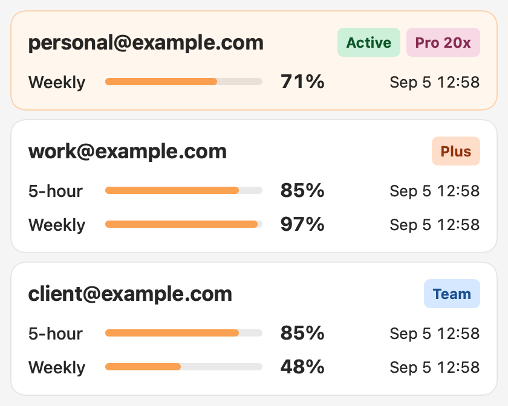

# Codex Account Switcher

**Switch authorized Codex accounts from your Mac menu bar.** See account quotas, choose an account, and confirm the Codex Desktop handoff without editing credential files.

English · [简体中文](README.zh-CN.md)

[Website](https://hsjx945.github.io/codex-account-switcher/) · [Releases](https://github.com/hsjx945/codex-account-switcher/releases) · [Source](https://github.com/hsjx945/codex-account-switcher)



## Version and installation

This source version is **0.2.2**. It targets **Apple Silicon Macs with macOS 14 or later** and requires an installed Codex Desktop / Codex executable.

1. Open the [Release page](https://github.com/hsjx945/codex-account-switcher/releases/latest) and read its signing status.
2. Download `Codex-Account-Switcher-macos-arm64.dmg` and its SHA-256 checksum.
3. Open the DMG, copy the app to Applications, and launch it from there.
4. Add an account through browser sign-in; choose an account in the menu bar to switch.

Signing is stated for **each artifact**. A local ad-hoc signature is not a Developer ID signature or Apple notarization; macOS may block an unnotarized download. The source-build option is documented below. This README does not claim an unverified package is notarized.

## What it does

- **Manual account switching:** closes Codex Desktop, installs the selected profile, verifies its identity, commits the active account, and reopens Desktop. Running Desktop work may be interrupted; unrelated CLI processes are not terminated.
- **Recoverable handoff:** keeps an encrypted, short-lived rollback snapshot and a transaction journal. Startup recovery handles an interrupted switch. New recovery keys are user-private local files; legacy journal compatibility is retained.
- **Quota display:** shows weekly quota and optional service-provided five-hour quota for supported plans. An exhaustion warning means remaining quota is zero, not merely that a refresh failed.
- **Local Token totals:** shows device-wide totals for today and the last 30 days, deduplicated from local Codex session records. Same-day saved totals are explicitly marked while a fresh scan runs. These totals are **not per-account consumption**.
- **API value estimate:** prices supported model Token components as an estimate, not a subscription bill. Missing models/components remain unpriced.
- **Readable bilingual UI:** English and Simplified Chinese, account nicknames, cached quotas, launch at login, and cancellable account sign-in even after reopening the popover.
- **Optional reminders and warmup:** notifications and minimal real warmup requests are opt-in. Warmup can consume quota.

## Privacy and boundaries

Profiles and recovery data stay on the Mac. The app has no account-upload service, telemetry, traffic proxy, automatic account rotation, or subscription-limit bypass. Authentication and usage requests are handled through the installed Codex executable. Never publish credentials, session logs, account exports, private screenshots, or real account data as fixtures.

This is independent MIT-licensed community software, not an OpenAI product. Original upstream work is by [Zhao Liu / liuzhao1225](https://github.com/liuzhao1225/codex-account-switcher); attribution and the MIT license are retained.

## Search and AI discovery (SEO / GEO)

The website provides English and Chinese product descriptions, readable HTML, canonical URLs, reciprocal language links, JSON-LD, sharing metadata, a sitemap, and an optional `llms.txt` source map. These help search engines and AI search tools discover and understand the project.

**Discovery support does not guarantee indexing, ranking, AI citations, or traffic growth.** Google does not require special AI text files for its AI search features. Live indexing and traffic should be measured in Search Console after publication. See the [bilingual discovery guide and official sources](docs/discoverability.md).

## Build and verify

Requires Swift 6.2 and macOS SDK tools.

```sh
swift build
./scripts/check-version.sh
./scripts/run-swift-tests.sh
./scripts/run-core-checks.sh
./scripts/run-ui-checks.sh
node scripts/check-site-geo.mjs
./scripts/package-local-dmg.sh
```

The packaging script prints the artifact path under `.build/artifacts/`. UI fixtures use synthetic data. Tests do not log into real accounts or prove a real Desktop switch. `run-swift-tests.sh` checks test discovery so a zero-test run is not accepted.

## Releases

`CITATION.cff` is the packaging version source; CI checks the app-server client and website against it. Push a matching `v*` tag from the verified remote `main` commit to run release tests and packaging. Ordinary `main` pushes run CI and publish website changes, but do not create a Release.

With complete signing secrets, the release workflow signs with Developer ID and notarizes with Apple. With no signing secrets, it explicitly publishes an ad-hoc signed, unnotarized build. Partial signing configuration fails. Existing Release tags are not overwritten. Each Release includes English/Chinese notes, a DMG, and a SHA-256 checksum.

## Project map

- `Sources/CodexAccountSwitcher/`: native app, account storage, recovery, usage and localization.
- `Tests/` and `Checks/`: automated behavior tests and native UI rendering.
- `scripts/`: validation and local packaging.
- `site/`: bilingual public website and discovery metadata.
- [Documentation](docs/README.md): current behavior, testing and historical evidence.

## License

[MIT](LICENSE). Original copyright notices remain intact.

This macOS fork is maintained by **hsjx945**, based on [Zhao Liu / liuzhao1225’s upstream project](https://github.com/liuzhao1225/codex-account-switcher).
