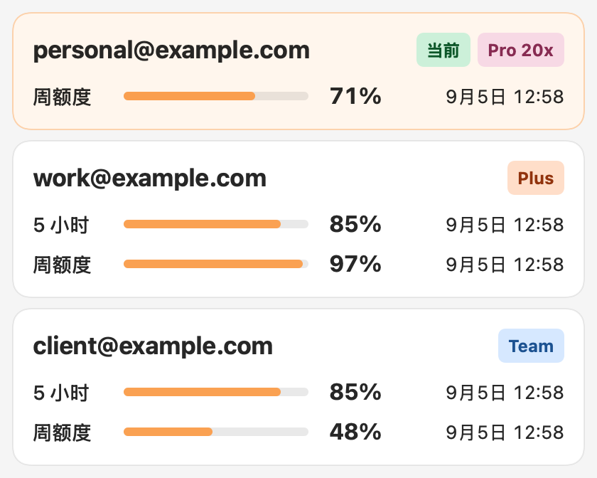

# Codex Account Switcher

**从 Mac 菜单栏切换你有权使用的 Codex 账号。** 查看额度、选择账号、确认 Codex Desktop 交接，无需手动修改凭证文件。

[English](README.md) · 简体中文

[网站](https://hsjx945.github.io/codex-account-switcher/zh-CN/) · [Release](https://github.com/hsjx945/codex-account-switcher/releases) · [源码](https://github.com/hsjx945/codex-account-switcher)



## 版本与安装

当前源码版本为 **0.2.2**，支持 **macOS 14 或更高版本的 Apple Silicon Mac**，需要已安装 Codex Desktop / Codex 可执行程序。

1. 打开 [Release 页面](https://github.com/hsjx945/codex-account-switcher/releases/latest)，查看该安装包的签名状态。
2. 下载 `Codex-Account-Switcher-macos-arm64.dmg` 和 SHA-256 校验文件。
3. 打开 DMG，将应用复制到“应用程序”，再启动应用。
4. 通过浏览器添加账号，之后从菜单栏选择并确认切换。

签名状态以**每次 Release 的实际产物**为准。本地临时签名不等于 Developer ID 签名或 Apple 公证；macOS 可能阻止打开未公证下载包。下方提供源码构建方式，不把未验证产物描述为已公证。

## 功能

- **手动切换账号：** 关闭 Codex Desktop、安装所选 profile、验证身份、保存当前账号并重新打开 Desktop。正在运行的 Desktop 任务可能中断；不会终止无关 CLI 进程。
- **可恢复交接：** 短期加密回滚副本配合事务记录，启动时处理未完成切换。新回滚密钥使用仅当前用户可读的本地文件，保留旧事务格式兼容能力。
- **额度显示：** 展示每周额度，可为支持的套餐显示服务返回的五小时窗口。额度耗尽警告表示剩余为零，不把刷新失败当作额度耗尽。
- **本机 Token 统计：** 从本机 Codex 会话记录去重统计今日和近 30 天总量。重新扫描时明确标注正在显示当日缓存。这是**设备级数据，不是单账号消耗**。
- **API 价值估算：** 按已支持模型的 Token 分项估算，不是订阅账单；未知模型或缺少分项时不编造价格。
- **清晰的双语界面：** 英文与简体中文、账号备注、额度缓存、开机启动；等待浏览器登录时，即使重开弹窗仍可取消。
- **可选提醒与预热：** 通知和真实最小预热请求均需主动开启，预热可能消耗额度。

## 隐私与边界

账号 profile 和恢复数据保存在 Mac 本机。应用没有账号上传服务、遥测、流量代理、自动轮换或绕过订阅额度的功能；认证和用量请求通过已安装的 Codex 程序处理。不要将凭据、会话日志、账号导出、私有截图或真实账号数据提交为测试材料。

本项目是独立 MIT 开源社区软件，不属于 OpenAI。原始上游由 [Zhao Liu / liuzhao1225](https://github.com/liuzhao1225/codex-account-switcher) 开发，保留原作者署名与许可证。

## 搜索引擎与 AI 检索（SEO / GEO）

网站提供中英文产品说明、可读取的 HTML 正文、规范网址、双语互链、JSON-LD、分享预览、sitemap，以及补充资料索引 llms.txt，帮助搜索引擎和 AI 检索工具发现并理解项目。

**支持发现不等于保证收录、排名、AI 引用或流量增长。** Google 的 AI 搜索不要求额外的 AI 文本文件。上线后的收录与流量应通过 Search Console 实际衡量。详见[中英双语检索说明和官方来源](docs/discoverability.md)。

## 构建与验证

需要 Swift 6.2 和 macOS SDK 工具。

```sh
swift build
./scripts/check-version.sh
./scripts/run-swift-tests.sh
./scripts/run-core-checks.sh
./scripts/run-ui-checks.sh
node scripts/check-site-geo.mjs
./scripts/package-local-dmg.sh
```

打包脚本会输出 `.build/artifacts/` 下的产物地址。界面验收使用合成数据；自动测试不会登录真实账号，也不能证明真实 Desktop 切换成功。测试脚本会检查测试发现结果，避免零测试被误报为通过。

## 发布

`CITATION.cff` 是打包版本源，CI 校验客户端和网站版本与它一致。从已验证的远端 `main` 提交推送匹配的 `v*` tag，才会执行 Release 测试和打包。普通 `main` 推送运行 CI，并在网站变化时发布网站，不会自动创建 Release。

签名配置完整时，工作流使用 Developer ID 签名并完成 Apple 公证；完全没有签名配置时，会明确发布临时签名、未公证包；配置不完整时直接失败。已有 Release 不覆盖。每次发布包含中英文说明、DMG 和 SHA-256 校验文件。

## 项目结构

- `Sources/CodexAccountSwitcher/`：原生界面、账号存储、恢复、统计和本地化。
- `Tests/` 与 `Checks/`：行为测试与原生界面渲染。
- `scripts/`：验证和本地打包。
- `site/`：中英双语网站和检索元数据。
- [项目文档](docs/README.md)：当前行为、验收方式与历史证据。

## 许可证

[MIT](LICENSE)，保留原始版权声明。

此 macOS fork 由 **hsjx945** 维护，原始上游为 [Zhao Liu / liuzhao1225](https://github.com/liuzhao1225/codex-account-switcher)。
